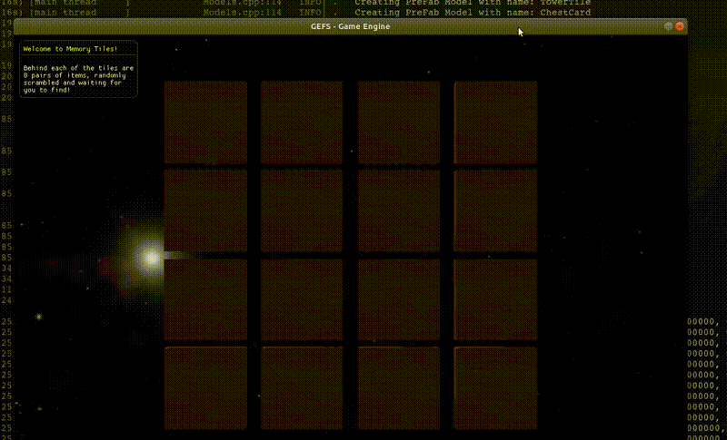

<<<<<<< HEAD
# HW4 [Memory Tiles Shader]
CSCI 8980 - Real-time Game Engine Design, Assignment 4

- Emily Moeller, [ecmoeller](https://github.com/ecmoeller)

## Building and Running Instructions
```
# build Makefile using cmake (need to do this for every additional C++ files added)
$ cd build
$ cmake ..

# build engine
$ cd GEFS
$ make -C <location of build/>

# to run a scene
$ cd GEFS
$ ./engine <folder containing main.lua> <optional config string>
```

Optional config strings are shown in `settings.cfg` as `[config string name]`. An option includes `[Debug]` which would then be run as follows:
```
$ ./engine <folder containing main.lua> Debug
```

## Resources
- Low poly tree obj package: [TurboSquid link](https://www.turbosquid.com/3d-models/blender-carrot-crystal-oak-tree-3d-model-1189852)

- Pirate Kit (1.1): Created/distributed by Kenney [(www.kenney.nl)](www.kenney.nl)

- Farm Animals Pack by Quaternius [https://www.patreon.com/quaternius](https://www.patreon.com/quaternius)

- Pirate Pack

- Potion Pack

- Farm Animals Pack by Quaternius [https://www.patreon.com/quaternius](https://www.patreon.com/quaternius)

- Nebula Skybox: Created by 'amethyst7' aka Chris Matz. WEB site: [http://amethyst7.gotdoofed.com](http://amethyst7.gotdoofed.com)


## Project Report

### Final Submission Video

[](https://drive.google.com/file/d/17fKi_CLu9FM_aSlv4TGW93ss_OIPm4TW/view?usp=sharing)

_This is a 2x sped up gif showing off our full Memory Tiles game. Click gif to go to a 1.5x sped up Google Drive video of our gameplay._


```


1. What features did you implement? Why did you choose these particular features?

	Building off the game I made for the last project, I decided to use the same objects as before. However, instead of the objects being covered by tiles, the tiles have been removed so the objects are simply positioned in a 4 by 4 grid. As for the shader code, the intent was to have a object appear like it was highlighted when it was clicked on. I choose this feature because I thought this was something that could have been incorporated into the game, to indicate that a tile had been selected. 
   
2. Algorithmically, how does you rendering implementation work. What formulas, algorithms, and techniques did you use? How scalable is your approach? What are the key bottlenecks?

    
3. From	a systems design perspective, how did you integrate your new rendering techniques with the rest of the code? How and when do you trigger a change in rendering? In what data structures is the information associated with rendering stored?
